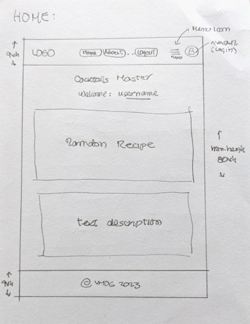
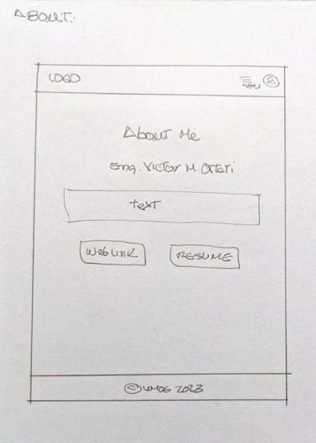
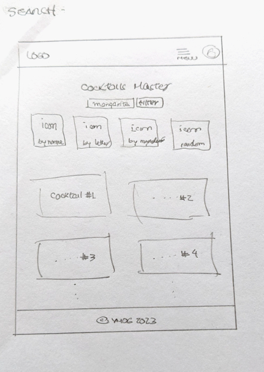
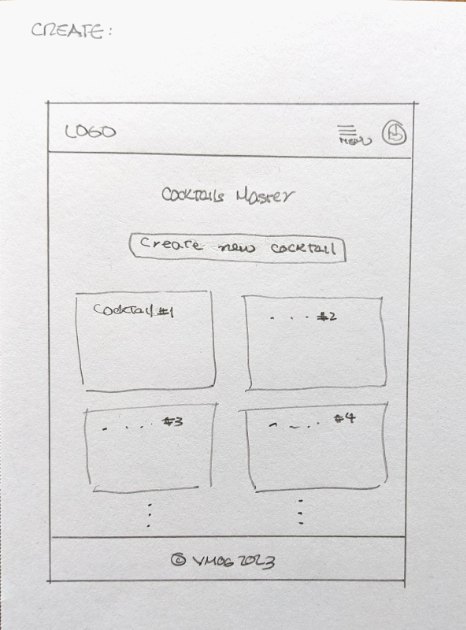
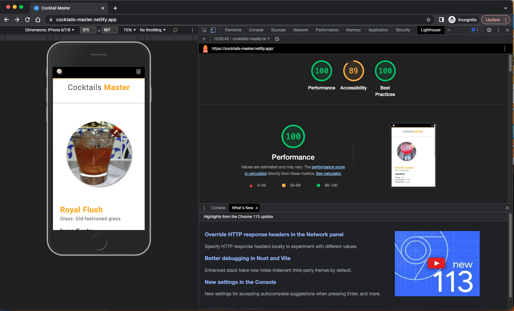

# cocktail-master

## NAV

[cocktail-master](https://github.com/VMO2020/cocktail-master)  
[cocktail-master-client](https://github.com/VMO2020/cocktail-master/blob/main/client/FRONTEND.md)  
[cocktail-master-server](https://github.com/VMO2020/cocktail-master/blob/main/server/BACKEND.md)  
[cocktail-master website](https://cocktails-master.netlify.app/)

## Frontend

1. create client folder
2. Initialize project

## Backend

1. create server folder
2. Initialize project

## Prepare for GIT

1. Move `.gitignore` from client/REACT to the ROOT and add: node_modules & .env
2. ADD: MIT LICENSE

## Create Github REPO

1. Terminal: `git init`
2. GitHub Repo: `cocktail-master`  (Public & without README)
3. Terminal: `git add .`
4. Terminal: `git commit -m "first commit"`
5. Terminal: `git branch -M main`
6. Terminal: `git remote add origin https://github.com/VMO2020/cocktail-master.git`
7. Terminal: `git push -u origin main`

[cocktail-master REPO](https://github.com/VMO2020/cocktail-master)

## User Target

`Our website caters to a diverse range of cocktail enthusiasts, including cocktail lovers, bartenders, party organizers, bars, and restaurants. For the cocktail lovers, we provide a treasure trove of cocktail recipes, allowing them to explore and indulge in a wide variety of delightful concoctions.`  

`Bartenders can find inspiration, refine their skills, and discover new techniques to elevate their craft. Party organizers can rely on our website to plan memorable events, with access to crowd-pleasing cocktail recipes and mixology tips.`  

`Bars and restaurants can leverage our platform to showcase their unique cocktail menus, attract patrons, and stay ahead in the competitive industry. Our website is a one-stop destination for all things cocktails, catering to the diverse needs of cocktail enthusiasts, professionals, and businesses alike.`

## Wireframes

  
  

  
  

## Lighthouse

  

